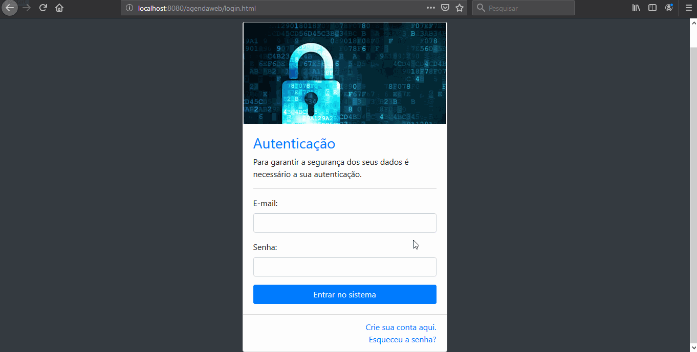
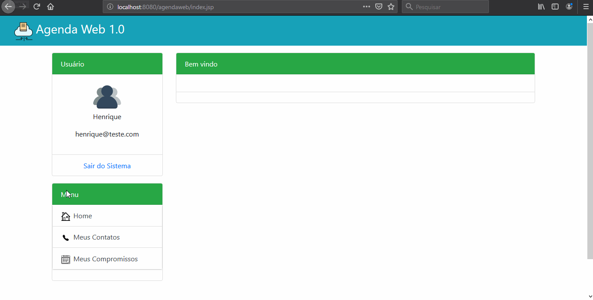

# Agenda-Web-Project
A Java Web project, a web schedule to register your contacts and commitments, update and delete it, easily and with a soft interface.
---

This project was built in SENAI technical school with the following goals:

- Learn about Servlets and JSP files
- Put on practice the concepts of object oriented programming with Java Web concepts, relating with MySQL database
- Follow the MVC pattern and prove it's importance
- Build an application that allows the CRUD operations to register relevant data
---

## Details
The project counts with some interesting details like:

- Login interface and logic

- Add a contact and it's information

- Add a commitment and it's details

- Bootrstrap framework help with the interface
- Password encryption

Version: 1.0

Creation: 10/06/2019

*Everything made with a lot of curiosity and programming passion* 

